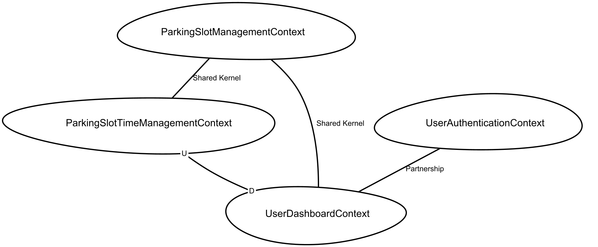

# Smart parking

## Introduction

### Overview
In many cities around the world parking has become a significant issue. As the number of cars on the road continues to grow, finding a place to park can be a real challenge. In this context, the parking situation is expected to become increasingly complicated in the next years.

A fully digitalized parking system that guarantees reliable information on parking space availability can be a viable solution. Such a system would enable citizens to trust that they can find a parking space when they need it.

In order to do that we want to create an application that allows users to find parking slots nearby, occupy one of them and, if needed, extend the occupation.
The application should have a user-friendly interface with several screens, including a login screen, a signup screen for new users, a password change screen and a home page for finding available parking slots nearby. 
The project should be developed using the Domain Driven Design (DDD) approach, with a focus on identifying and modeling the key entities, repositories and rules involved in the parking and user domain.

### Requirements

#### Business requirements
| ID | Requirement |
| -- | ----------- |
| BR1 | The application should provide an easy way for parking slot owners to manage their slots.

#### User requirements

| ID | Requirement |
| -- | ----------- |
| UR1 | Users should be able to create a new account by providing name, email, and password. |
| UR2 | Users should be able to log in to their account using their email and password. |
| UR3 | Users should be able to change their password. |
| UR4 | Users should be able to delete their account and have all associated data removed from the system. |
| UR5 | Users should be able to search for available parking slots near their current location. |
| UR6 | Users should be able to reserve a parking slot for a specific time period. |
| UR7 | Users should be able to extend the occupation of their parking slot. |
| UR8 | Users should be able to terminate parking slot occupation. |

#### Functional requirements

| ID | Requirement |
| -- | ----------- |
| FR1 | The system should allow users to register by providing name, email and password. |
| FR2 | The system should authenticate registered users by verifying their login credentials (email and password). |
| FR3 | The system should allow users to change their password at any time. |
| FR4 | The system should allow users to delete their account. |
| FR5 | The system should allow users to logout. |
| FR6 | The system should allow users to occupy a parking slot by selecting it from a map and specifying the end of stop. |
| FR7 | The system should allow users to extend the occupation of a parking slot for a specified period. |
| FR8 | The system should show to the user the state of the parking slots nearby him. |
| FR9 | The system should show to the user the parking slot currently occupied by him. |
| FR10 | The system should allow users to terminate the occupation of a parking slot. |

#### Non functional requirements

| ID | Requirement |
| -- | ----------- |
| NFR1 | The system should be easy to maintain and update. |
| NFR2 | The system should be able to scale horizontally in response to changing user demand. |
| NFR3 | The system response times should be fast enough to provide a smooth user experience. |

#### Implementation requirements

| ID | Requirement |
| -- | ----------- |
| NFR1 | The system should be designed using a modular architecture, following the principles of Domain-Driven Design (DDD). This includes clearly defined domain entities, services, and repositories. |
| NFR2 | The application should provide a RESTful API for accessing and modifying data. The API should use standard HTTP methods. |
| NFR3 | The deployment process of the backend and of the frontend should be automated. |

## Domain Analysis

### Knowledge crunching

In order to deal with the complexity of the project there have been a continuous exchange of information with the stakeholders. More specifically the information related to the system and the knowledge crunching process itself have been recovered through interviews.

* **How does a user access to the system?**\
The user access to the system depends on the fact that the user either access to the system for the first time or it already has an account.
    - **Sign up**: this operation allows a user that does not have an account to create one.
    - **Sign in**: through this operation is possible, for a user that already have an account, to access into the system

* **What is a park?**\
Within this application the park is the action that a person perform in order to put its own motorvehicle into a single parking slot.

* **What is a parking slot?**\
A parking slot is the place where a person can park its own motorvehicle

* **What does it happen when a user wants to park its car/motorcycle?**\
The user sees a free parking slot and occupy it with its car/motorcycle. After that from the app he/she selects the hour in which the stop will end.

* **How can a user see the parking slots status around the city?**\
The application shows every parking slot that is in a certain place. The place depends on the location of the user and on the distance of interest that the user specify. Every parking slot is shown in one of three possible colors: 
    - **red**: the parking slot is busy
    - **orange**: the parking slot will be free in few minutes
    - **green**: the parking slot is free

* **How does a user select the distance of interest in which he can see the parking slots?**\
The user can select the distance of interest specifying a range in which he wants to see the parking slots status.

* **Could a user increment the stop?**\
The user can increment the duration of the stop before the previous stop ends. More specifically he/she can only specify a time after the end stop time previously inserted.

### Ubiquitous language
The result of the previous knowledge crunching step has been the creation of a glossary with the goal to provide an ubiquitous language around the which develop the whole system. The glossary contains the following concepts:
* **Parking slot**: location where the user can park its own car/motorcycle
* **Occupy**: the action of moving a vehicle into a parking slot
* **Application**: Android application
* **End stop**: the time limit within the user must remove its vehicle from the parking slot.

### Use cases
After a proper domain analysis has been possible to detect the use cases and the entities that are involved into this system. The following imgage illustrates the uses cases for Smart Parking: 
 \
From the previous image is possible to see how in this system there are two main actors involved in the operations:\
* **User**: the user is the actor that is intended to use the application in order to look for free parking slot, to set an end stop time and to increment this time.
* **Client**: the client is the actor in charge to handle all the requests that are made by the user. More specifically the client is intended to handle the operation of registration and access to the system. The client is also in charge to handle a proper visualization of the status of the parking slots. It's also the client that is in charge to handle the setting of the end stop time or the increment of this time itself. \
It's possible to notice, from the picture, the following operations:
* **Access**: for the access operation the directionality is from the user to the client for the request and every possible check is handled by the client.
* **Check parking slots status**: in this case is the client that is in charge to periodically show to the user the status of the parking slots.
* **Park**: this operation involves the user that is involved into the selection of the parking slot that he wants to occupy and into the setting of the end time and, at the same time, involves the client that is in charge to change the status of the specified parking slot.
* **Extend stop**: with this operation the user extends the end stop time and the client is in charge to handle this extension by meaning of properly change the status of the parking slot. For example turning the color of a certain parking slot from orange to red.

### User stories
After the collection of the main use cases for the system have been collected some user stories that describe the operativity of the system under certain circumstances. More specifically the user stories illustrated are the following:
* The user access to the system
* The user park its own car
* The user checks for the status of parking slots in the map
* The user extends its stop
In the following are illustrated the user stories:

### Strategic Design

#### Bounded Context
Knowledge crunching phase allowed to find the BC of the system:
* **Parking-slot management context**: TODO
* **Parking-slot time management context**: TODO
* **User authentication context**: responsible to all user-related operatins, such as sign-in, sign-up and account deletion. It also authenticate user allowing him to use protected services (such as parking slot occupation).
* **User dashboard context**: it's the frontend application, the Android client, responsible to show backend data to the user

#### Context Map
Bounded contexts relationship was modeled in a context map. The context map was generated using Context Mapper VSC's extension.

## Design

### Architecture and implementation
The architecture decided to adopt is a simple Client/Server architecture, with the client (the Android app) that is in charge to handle the interaction with the user and the backend (the server) that is in charge to provide consistent data related to the parking slots and that is in charge to handle the registration/access procedures. \
A first general consideration is meaningful considering the separation between the logic/storage component (the backend) and the logic/presentation component (the frontend). This separation has been the result of a deep analysis and it resulted as the best choise because of the possibility to have independence in both architecture and implementation of each part. More specifically, adopting this philosophy of separation of concerns at the architectural side has been possible to choose the database that turned out to be the best for us and to choose the web service framework totally free.
It's important to have a deeper view on both side, frontend and backend, in order to better analyze their own architecture.

#### Backend
The backend is composed by the database and by the software that is in charge to define the logic behind the access to the database. More specifically there are two main component:
* **Database** two different databases was used for the application, one for the user authentication bounded context and one for the parking slot management bounded context. Databases was each stored on MongoDB Cloud.
* **Web Service**
While there's not too much to say about the database it's important to talk about the web service. There are two main routes:
* **/user**
* **/parking-slot**
Each of these routes is in charge to recall logic to handle either the user access/registration to the service or to retrieve/update from/to the database the infromation related to the parking slots.

##### Backend: general concepts
There have been several theoretical consideration that led to choose a specific typology of either database or web framework rather than the another one.
* **Database**: the choise of a NoSQL address has been the result of a simple consideration: since the data in this application have a core into the parking slots it has been wise to map this core even into the database. Adopting a NoSQL database like **MongoDB** made it easier to organize the several documents indexing each one by the parking slot identifier.
* **Web Service**: the choise of the web framework to use for the backend has been led by the consideration of have a single language across the whole application. In order to achieve this goal has been used Ktor as web framework (implemented in Kotlin). In order to implement the routes for the web service has been adopted a ReST approach in order to create ReSTful API. \

##### Backend: architecture
The architecture adopted for the backend has followed the rules of the **Clean architecture**. This architecture led to the detection of several layers for the application and has been applied to both the two modules that the backend has: **user** and **parking slot**. The layers detected are the following:
* **entity**
* **use cases**
* **interface adapter**
* **framework**

In the following is reported the architecture for each module:

###### User 
* Entity:
    - **User**: completely mapped in the database, it represents all used information about the user (email, password and name).
    - **User credentials**: represents a id-password pair used from the user to log him into the system (the user identifier is the email address).
    - **User info**: objects that represent the user's not sensitive information. It corresponds to a user object without password field.
* Use cases:
    - **Login**: a user provides his identified and password to access the system.
    - **create user**: a user wants to register him on the sistem.
    - **Get info**: a user wants see him account information.
    - **Change password**: a user wants to change his password with a new one. 
    - **Delete user**: a registered user wants to delete his account.
    - **Validate**: a email-password pair must be validated (checking if a user with this email exists in the database and if the associated password corresponds with the one in the email-password pair).
    - **Exists** an user email must be verified checking in the database if there's a registered user with this email

* Interface adapter:
    - handles the framework layer requests, translating them into use cases.

* Framework:
    - It's represented by KTOR web server and Mongo database.

###### Parking slot
* Entity:
    - **Paring Slot**: this entity is completely mapped into the database and      represents a single parking slot. Any other component of the parking slot module depends on the parking slot entity.

* Use cases:
    - **Occupy a slot**: this is the use case in which a user is intended to occupy a parking slot for a certain amount of time
    - **Increment occupation**: this is the use case in which a user is intended to extend the occupation of a certain parking slot.
    - **Free slot**: this is the use case in which a user free the parking slot previously occupied.

* Interface adapter:
    - This layer is in charge to handle the requests coming from the framework, that is the most external layer, and translate them into use cases.

* Framework:
    - In this case is represented by the web server and by the database choose for the purpose.

##### Backend: implementation
The technologies used for the implementation of the backend are the following:
* [Ktor](https://ktor.io/): this is the web framework of the Kotlin language used to implement the Rest API.
* [MongoDB](https://www.mongodb.com/): this is the NoSQL databse choose for the purpose of this application.
* [Gradle](https://gradle.org/): as build automation tool has been chosen Gradle.

In the previous section has been reported as the application is composed of two modules related to the functions for the **user** and the functions for the **parking slot**.\ 
The user operations are all those operations related to the access of the user to the system. The parking slot operations are all those operations that are related to the management of parking slot status. These operations are mapped into two submodules for the implementation side correspond to two several collections into the database.
Considering the implementation aspects each module is a single gradle module. More specifically there are three modules:
* **Parking system**: this is the main module, in which there's the access point for the application and the framework layer from the previous paragraph. 
    - **user**: the submodule related to the operations for the user access to the system.
    - **parking-slot**: the submodule related to the operations for the parking-slot management.

###### User

###### Parking Slot
In order to talk about the implementation of the parking slot operations inside the submodel **parking-slot** is important to keep together implementation and clean architecture. The clean architecture previously presented is composed of four layers. The three inner layers (entity, use cases and interface adapter) correspond to three packages into the **parking-slot** submodule. The fourth layer (framework) is outside this module by the moment it is common to both **parking-slot** and **user** submodules. In the following are reported more specifically the element that fill any of the three layers of the **parking-slot** submodule:
* **entity**: in this package there are all those entities that are the domain basis for the parking-slot subproject. These core entities are:
    - **Position**: represents a single position expressed as latitude-longitude coordinates. This entity is helpful because it provides the exact location for each parking slot.
    - **Center**: represents the area around the which the user is interested about the status of the parking slots.
    - **StopEnd**: represents the end stop setted or incremented for a certain parking slot.
    - **ParkingSlot**: represents a single parking slot with its properties: the status (either occupied or not), the position expressed as latitude and longitude, the end stop time and the identifier (that is unique for each parking slot)
    All these entities are modelled as **Kotlin** classes. This choise derived by the consideration about the possible inheritance of these classes. By the moment these entities could be subjected to inheritance in future uses and future development of the domain the choise has been to model them as classes.

* **use_cases**: in this package are reported the use cases, representing the second layer of the clean architecture previosuly presentend. Remaining on the implementation side the use cases have been represented as method of an interface to be implemented by the interface adapter. This is because the interface adapted is in charge to implement the methods translating into it the framwework requests.

* **interface_adapter**: this package contains a class, **InterfaceAdapter**, that receives as constuctor parameter a collection of the MongoDB database, in this case. This class implements the UseCases interface and provide the results that are used into the framework package to provide the responds to the incoming requests from the client. It's important to notice how, implementing the Interface adapter in this way, the use cases remains independent from it and, in case of change of the Database, will only be necessary to change the constructor argument and some operation inside this class. This solution has been thought to be aligned to the SoC principle and, furthermore, to be coherent with the previous domain analysis.

#### Client

### CI/CD

The platforms and tools for CI/CD that have been chosen are the following:
* **GitHub**
* **GitHub Actions**
* **Docker**

In order to provide a better organization for the whole project have been created 2 repositories on GitHub. Each repository have a different and isolated CI/CD pipeline. This choise has been led by the consideration about the fact that in order to address the scalability the backend could change in different manner and could be developed by people that are independent by the ones that implement the frontend.

#### CI/CD Backend
As previously said have been chosen two different CI/CD pipelines, corresponding to the two repositories created on GitHub. For the pipeline related to the backend repository have been created two workflows for the two main branches:
* **/dev**: there is a workflow that begins its execution everytime there's a push on **/dev** branch. This workflow is helpful because it is in charge to execute the tests calling a **gradle build**.
* **/master**: here there's the most important workflow, because at every push on the branch **/master** the workflow is in charge to push a docker image previously defined into a docker file on DockerHub. It's important to report the main features of the defined dockerfile:
    - it starts from an **Ubuntu** image.
    - install all the needed packages and then clone the repository, checkount on master and then executes the **./gradlew build**. This is done before the image is pushed. When the container is pulled and executed the application starts executing the **./gradlew run** and exposing the API on 8080 port.

#### CI/CD Frontend

## Installation